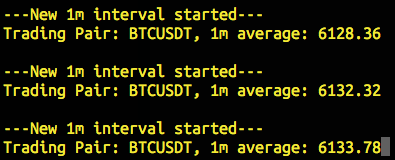

##Binance Market Display

 - ##### Displays the current average trading price in a given window of time
 - ##### Average price updates every second

###Dependencies:
- python 3.x
- requests
- pandas

###Running:
- Command line parameters:
        --pair (-p), 
        --decimals (-d), 
        --interval (-i)

    --pair is the trading pair, --decimals controls points of precision, and 
    --interval determines the window length.

###Example:
If you want to see the average ETH/USDT price in 5-minute intervals:
    `python binancewatch.py -p ETHUSDT -d 8 -i 5m`

Default parameters are set for BTCUSDT with 2 points of precision and 1 minute windows, simply run:
`python binancewatch.py`